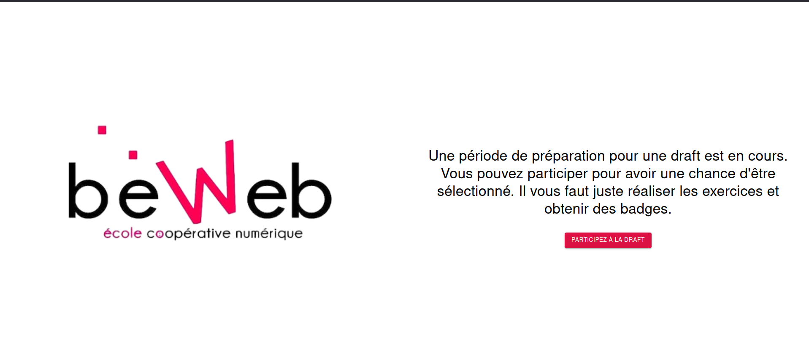
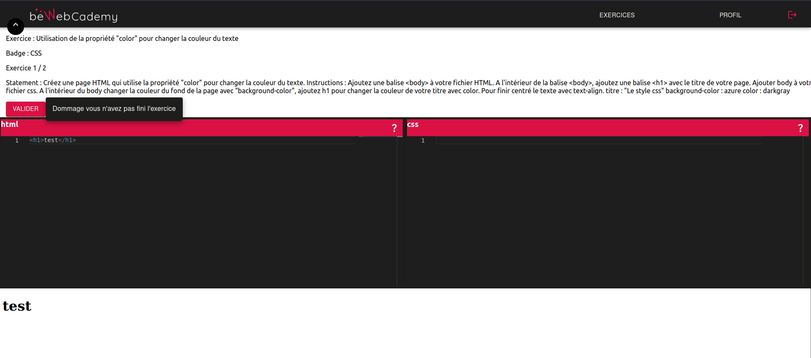
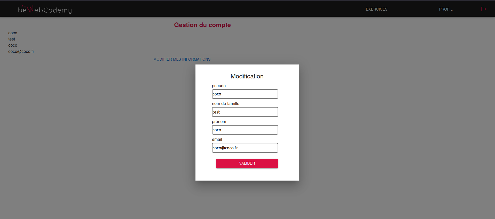
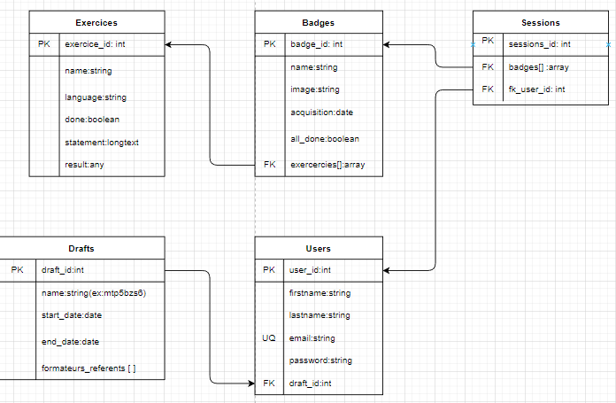
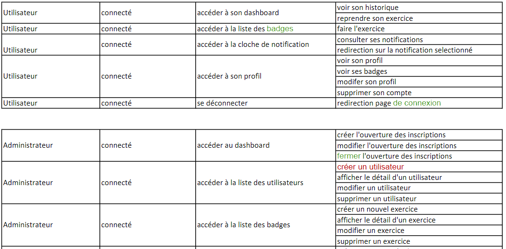
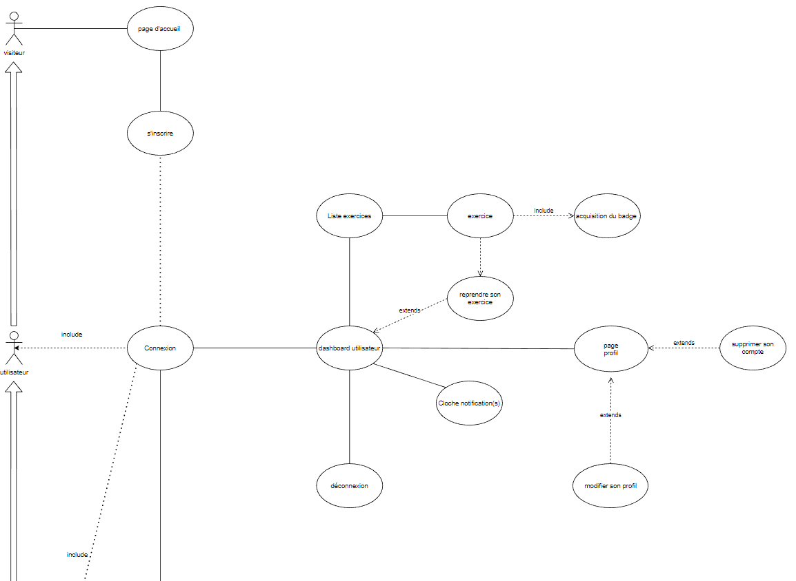

# BewebCademy

L’application doit permettre à des personnes voulant intégrer la formation Développeur Web et Web Mobile, de **passer une série d'exercices basiques et pratiques sur le modèle de Codecademy** afin que l’équipe pédagogique puisse contrôler l'avancée dans les badges. Un badge etant une récompense suite à la réussite d'une série d'exercices.

Afin de fournir les fonctionnalités souhaitées dans le temps imparti, le design, et la typographie **n'ont pas été terminés**.

## Techno et outils utilisés
- Javascript et React
- NodeJs (express, mongoose, axios)
- Python (script créé pour automatiser les commits sur les 6 repositories correspondants aux services)
- MongoDB
- 6 micro-services gérés avec node et RabbitMQ
- Keyclock
- MonacoEditor
- Methode Merise (MCD, MLD)
- Postman (très utile lors de la phase de test des micro-services)

## Accueil
Ouvert si une formation est en preparation chez Beweb, redirige vers une page de login gerée par Keyclock.

## Exemple d'exercice

## Gestion du compte utilisateur
Update possible pour l'utilisateur sur ses informations

## Espace admin
L'espace admin sert à **gerer les utilisateurs inscrits**, voir leur progressions dans les badges et exercices ainsi qu'à **créer de nouveaux exercices** ou nouveaux badges. 5 languages sont disponibles actuellement pour des exercices et sont utilisés dans des éditeurs avec MonacoEditor.

## Gestion du temps de travail
Nous avions **6 semaines** pour réaliser ce projet, pendant les 3 premières nous avons réalisé tous les **diagrammes nécéssaires** (user story, use case, diagrammes de sequences et d'activité, MCD et MLD) et le maquettage afin de sprinter sur les 3 semaines suivantes et fournir une application fonctionnelle.

### Exemple de diagrammes réalisés
#### MDP

#### User Story

#### Use Case

